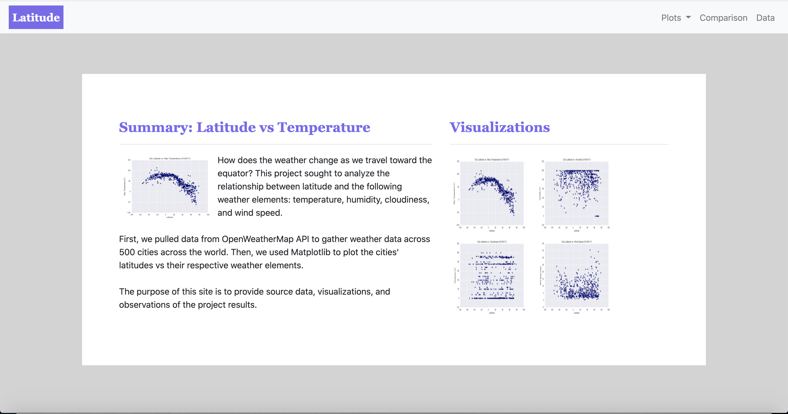

# Web-Design-Challenge
> In this project, I created a dashboard displaying and summarizing the results of a latitude vs. weather analysis.

## The Process
* First, I created the basic structure of the dashboard by inserting plots, descriptions, and the navbar into the website. I used HTML for this. The pages on the website include:
  * A landing page: the project overview
  * Four visualization pages: the weather plots and analyses
  * A comparisons page: all of the weather plots of one page
  * A data page: a responsive table containing the data
* Next, I used CSS (Bootstrap elements) to style the webpage.

## Website Preview

